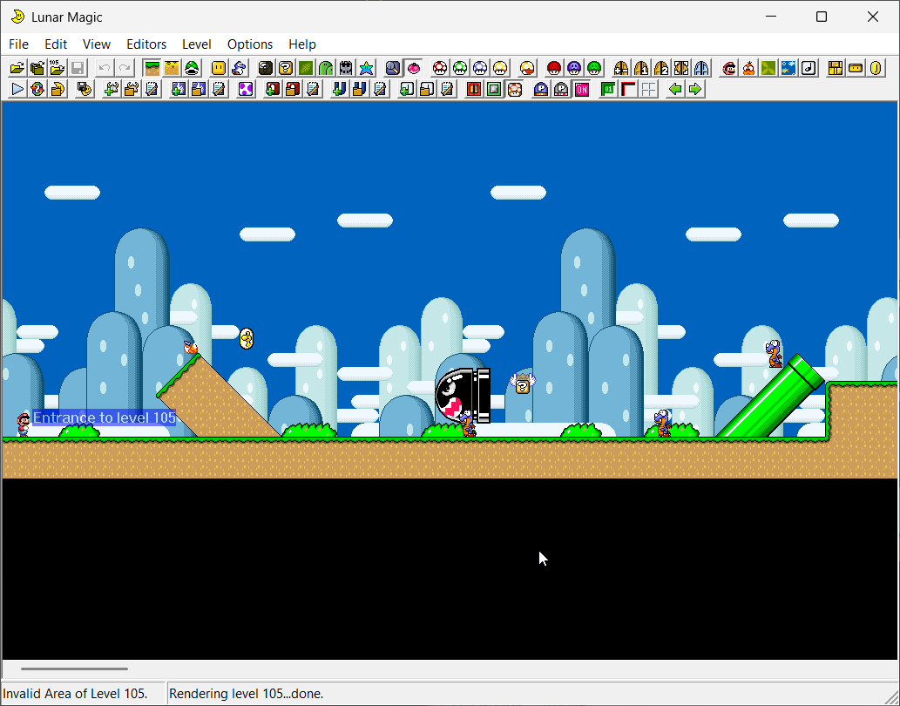

# AmperSam's SMW Baserom Template

A blank Super Mario World baserom template that uses some PowerShell scripts to initialize a project and makes use of Lunar Magic's user toolbar functionality for building your project.

This resource is simply an organizational aide and doesn't teach you how to use custom resources or use the various tools within, nor any level design. It is just a folder structure with a handful of useful scripts and just exists to help you get better organized when creating a baserom for a Super Mario World hack or as a blank canvas for starting a new ROM hack project.

## "What is a Baserom?"

A "baserom" in hacking jargon is just a term for a specific collection of tools, patches and custom assets that serves as the "base" for making a ROM hack. For example, the Romhack Races community provides a baserom to creators wishing to make a race level, and it is tailored to their requirements so there is consistency across all levels.

## Getting Started

### Provide Super Mario World

First, put a copy of your (headered) Super Mario World ROM and put it in "workspace" folder of this baserom template. You can rename it to whatever you like, e.g. `MyBaseRom.smc`, since the build processes are indifferent to the file name. If your ROM has a file extension of `.sfc` rename it to `.smc` this prevents minor headaches elsewhere.

### Initialize the Baserom Tools

This resource comes with a first-run script `!initialize_baserom.bat` to setting up you project. It will automatically download all the common tools, if they aren't detected, and set them up for your convenience in the "tools" folder.

### Initialize Your ROM in Lunar Magic

Before getting started with building, make any small change and save your ROM in Lunar Magic. When you do this, Lunar Magic will perform some small hijacks and setup its restore function.

Next, extract all Graphics and ExGraphics from your ROM using `File > Graphics > Extract GFX from ROM` and `File > Graphics > Extract ExGFX from ROM` this will populate the 'Graphics' and 'ExGraphics' folders in the workspace folder with SMW graphics files as well as install some more hijacks into the ROM.

It is also common to Expand your ROM to at least 2MB via `File > Expand ROM > Expand ROM to 2MB` to give yourself enough headroom to make changes and add things to your hack.

## Lunar Magic User Toolbar

To make life easier for you as a hacker, this project template comes with a custom User Toolbar in Lunar Magic (which you can see in the screenshot above). It uses a script on the backend to automate the process of applying additional custom assets to your ROM right from Lunar Magic without the need for scripts or dragging your rom around.

## Project Folders

### docs

The initialization script moves all the readmes and other documentation from the various tools to this folder, if they have any, for easy access.

### init

This contains the resources used to initialize the project. This includes some template list files that replace the default tool list files, the User Toolbar files, and initialization scripts.

### tools

Folder where all the baserom tools will be "installed" by the initialization script.

### workspace

This is your project's main folder. It will contain the ROM for your project, any auxillary files generated by tools, and the graphics files extracted from your ROM.